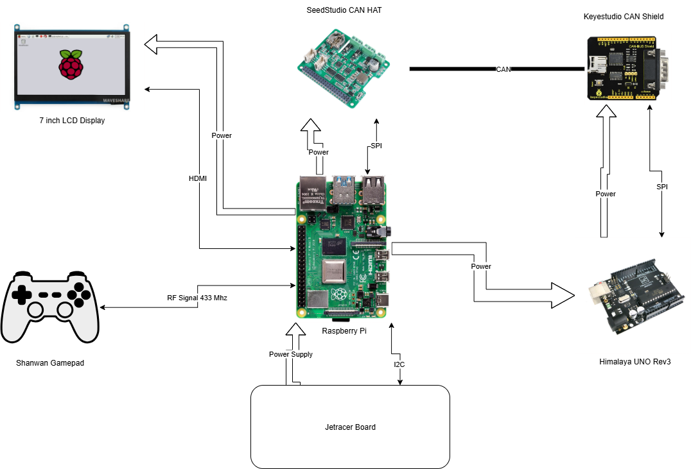

# DES Instrument Cluster

This project is a documentation of the fulfilment of the project requirements as requested from SEA:ME . 

## Directory Structure

```
.
├── Arduino
│   ├── LM363_BasicSketch
│   └── SpeedSensor_CAN
├── Cluster-app
│   ├── design
│   │   └── asset
│   └── src
└── Documentation
```

## Getting Started

### Prerequisites

- For Speed Sensor Side:
  * Himalaya Uno Rev 3 (or any Microcontroller Development Board of your choice e.g. Arduino Uno)
  * LM363 Optocoupler Speed Sensor
  * Keyestudio CAN Shield for Arduino Uno
  * Arduino IDE
  * TimerOne and CAN library from the Arduino IDE Library Manager
- For Instrument Cluster Side:
  * Raspberry Pi 4B
  * SeedStudio CAN HAT for Raspberry Pi
  * QT dependencies
  * 7 inch LCD Display (either HDMI or DSI will do)
 
## Architecture



### Installation

1. **Arduino Setup**
   - If not previously available, download the TimerOne and CAN library 
   - Compile and Upload the Arduino code from `Arduino/SpeedSensor_CAN/SpeedSensor_CAN.ino` to your device using the Arduino IDE

3. **Systemd Service**
   - Copy `systemd/des_instrument.service` to `/etc/systemd/system/`.
   - Enable and start the service:
     ```sh
     sudo systemctl enable des_instrument
     sudo systemctl start des_instrument
     ```

### Usage

- On boot, the systemd service will start the Python scripts for robot control and battery display.
- Arduino firmware will continuously read sensor data and send messages over CAN bus.
- Python CAN Handler will relay CAN messages to connected clients in JSON format.

## Contributing

Pull requests are welcome! If you have suggestions for improvements, please open an issue or contact the maintainers.

## License

This project is licensed under the MIT License. See the [LICENSE](LICENSE) file for details.

## Authors

- [SkySom13](https://github.com/SkySom13)

---

*For questions or support, open an issue in this repository.*
